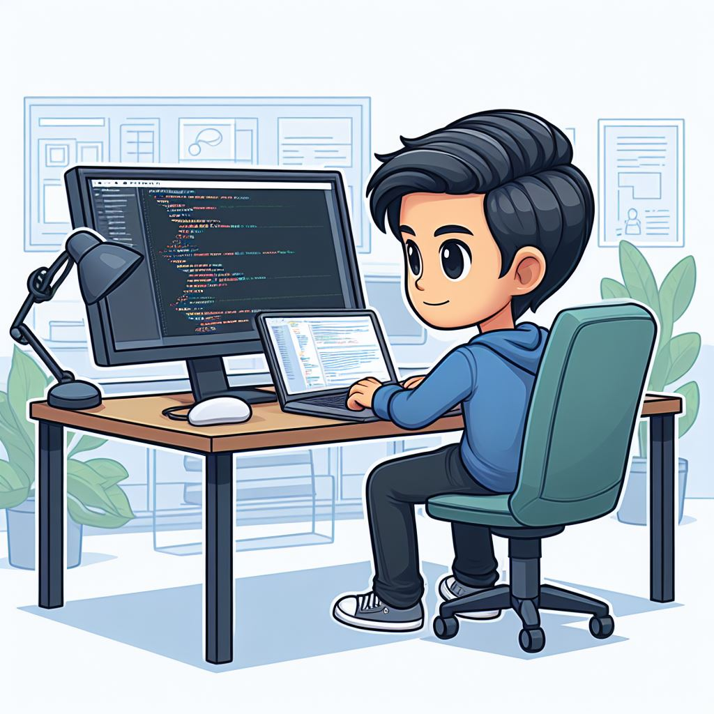

### Hi there 👋

#### This is Chitab 🙏🏻
#### I am a passionate Frontend Web Developer with 5 years of experience creating engaging user interfaces and experiences.

**About Me**
- 💼 I have 5 years of professional experience in frontend development.
- 🚀 I specialize in technologies like React, JavaScript, HTML, and CSS.
- 💻 I have a strong background in responsive design, cross-browser compatibility, and performance optimization.
- 🌱 I am always learning and exploring new technologies to stay updated with industry trends.
- 📫 You can reach me at [mail](mailto:chitab703kumar@gmail.com)
- 📫 Also You connect with me on [LinkedIn](https://www.linkedin.com/in/chitab-kumar-501006a3/).

**Languages and Tools:**  

    &nbsp;
    &nbsp;
    &nbsp;
    &nbsp;
    &nbsp;
    &nbsp;

 

[]

 

